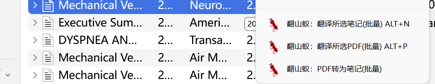

# Zotero Translate Ant

_适用于 Zotero 7.0 最新测试版_

## [安装Zotero 7.0 Beta](https://www.zotero.org/support/beta_builds)

<!-- [Mac (requires macOS 10.12 or later)](https://www.zotero.org/download/client/dl?platform=mac&channel=beta)

[Windows 64-bit Installer](https://www.zotero.org/download/client/dl?platform=win-x64&channel=beta)

[Windows 64-bit ZIP (recommended for temporary usage; see below)](https://www.zotero.org/download/client/dl?platform=win-x64-zip&channel=beta)

[Windows 32-bit Installer](https://www.zotero.org/download/client/dl?platform=win32&channel=beta)

[Windows 32-bit ZIP](https://www.zotero.org/download/client/dl?platform=win32-zip&channel=beta)

[Linux 64-bit](https://www.zotero.org/download/client/dl?platform=linux-x86_64&channel=beta)

[Linux 32-bit](https://www.zotero.org/download/client/dl?platform=linux-i686&channel=beta) -->

## 安装插件

1. 下载 [zotero-translate-ant.xpi](https://github.com/seasideccm/zotero-translate-ant/releases/download/v0.1.5/zotero-translate-ant.xpi)
2. 打开 Zotero，点击“工具”菜单，点击“plugins(插件)”，打开 Add-ons Manager。
3. 将 zotero-translate-ant.xpi 拖拽到 Add-ons Manager 窗口中。
4. 重启 Zotero。

## 使用 Zotero Translate Ant

1. 点击菜单栏上 **翻山蚁** 按钮弹出功能菜单。

   </img>

   
</img>

2. 在条目上点击右键弹出功能菜单。

   </img>
